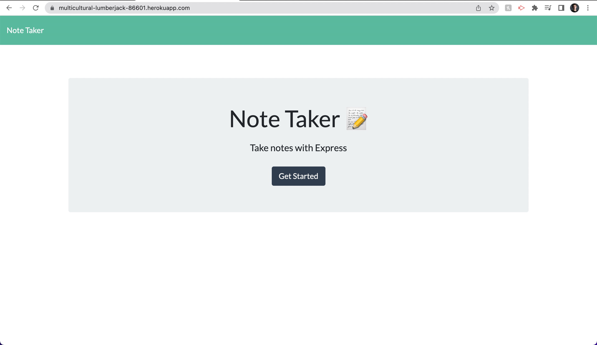
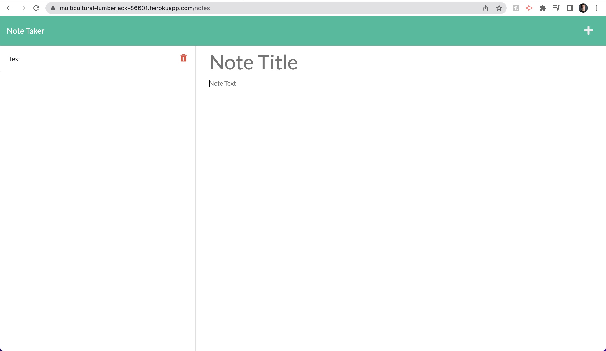
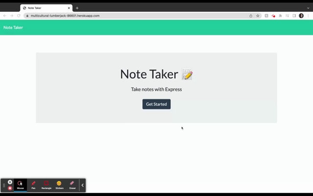

# Express.js Note Taker

## Description
This is a note taking application. The simlpicity of the application opens up the functionality to countless possibilities. Whether you want to make a grocery list, write a reminder for yourself, or outline an essay, this note taking app is easy to use.

## Table of Contents
- [Demonstration](#demonstration)
- [Installation](#installation)
- [Usage](#usage)
- [Credits](#credits)
- [Questions](#questions)

## Demonstration

## Installation
To install this application, go to https://github.com/JackAtkerson/atkerson-note-taker and clone the repository to your local work environment. Install npm by entering "npm init" in your command line. After npm is installed, install express with the command "npm i express".

## Usage
To access the note taking application, go to https://multicultural-lumberjack-86601.herokuapp.com/

## Credits
Made by Jack Atkerson
Starter code from: https://github.com/coding-boot-camp/miniature-eureka

## Questions
Feel free to reach out to me at:
[E-Mail](mailto:jatkerson18@gmail.com),
[GitHub](https://github.com/JackAtkerson)